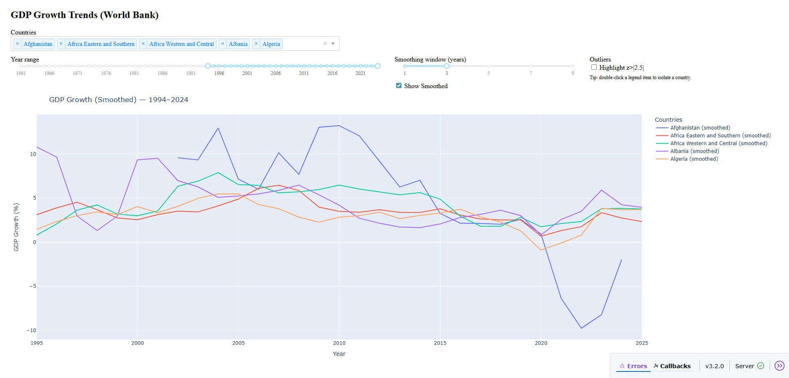

# GDP Growth Dashboard

An interactive dashboard to explore GDP growth trends by country over time.

Built with Dash, Plotly, Pandas and NumPy, this tool reads GDP data, computes annual growth, applies smoothing, detects outliers and renders a clear visualisation of long-term trends. It is useful for analysts, students and anyone exploring economic change across regions.

---

## Project Highlights

- Dashboard built with Dash and Plotly  
- Clean NumPy-based data transformations  
- Configurable smoothing (moving average)  
- Z-score-based outlier highlighting  
- Reusable helpers in `sample.helpers`  
- Flat imports for clarity (e.g., `pandas.read_csv`)  
- Unit and integration tests with `pytest`  

---

## Getting Started

Install dependencies in a virtual environment:

```bash
pip install -r requirements.txt
```

###  Run the app:

```bash
python -m sample.core
```

### Then open your browser at:
```cpp
http://127.0.0.1:8050
```

## Testing

### To run all tests:
```bash
pytest
```

### Includes:
* Basic tests for GDP growth, smoothing and z-score logic
* Advanced tests for full pipeline including resampling and edge cases

## Project Layout
```bash
data/
    long_preview.csv       # Input data
sample/
    core.py                # Dash app logic
    helpers.py             # Pure functions (growth, smoothing etc.)
tests/
    test_basic.py          # Unit tests
    test_advanced.py       # Pipeline/integration tests
```

## Screenshot



To generate this image, run the app, open the dashboard in a browser and save a screenshot as dashboard_screenshot.png in the project root.

## Future Improvements
* Add Docker support
* Deploy to Heroku or Render
* Add CLI for preprocessing and automation

## Strengths & Pitfalls

### Strengths
* **Modular Design:** Core logic for GDP growth, smoothing and z-score calculation is extracted into reusable helper functions in sample.helpers

* **Flat Imports:** The code uses fully qualified flat imports like pandas.read_csv which improves clarity and avoids alias conflicts

* **Testing:** The project includes unit and integration tests using pytest which helps catch issues early and supports maintainability

* **Data Pipeline:** GDP data is cleaned, resampled and transformed in a structured way using Pandas and NumPy

* **Interactive Dashboard:** The dashboard is clean and responsive with real-time filtering by country, time range and smoothing settings

* **Version Compatibility:** The codebase handles deprecations and version compatibility with Pandas and Dash (e.g. resample, app.run)

* **Readable and Documented:** The project is well-commented and the file structure is intuitive

### Areas for Improvement
* **Missing Data Sensitivity:** The growth calculation can be distorted by very small or missing values, producing unrealistic percentages

* **Extreme Outliers:** Without capping or filtering, some growth rates may appear exaggerated (e.g. ±700%) especially when smoothing = 1

* **No Data Validation Layer:** There is no formal schema or validation to ensure the CSV structure matches expectations before parsing

* **Manual Screenshot for README:** The dashboard image must be generated manually and may go out of sync with the latest visual state

* **No Deployment Config:** There is no Dockerfile, environment specification or deployment setup for running this on Heroku, Render or another host

* **No CLI or Configurable Parameters:** Important settings like smoothing window or z-score threshold are not exposed for scripting or automation