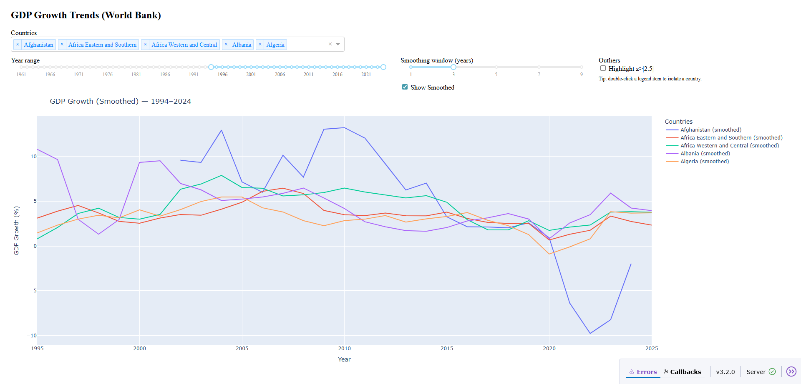

GDP Growth Dashboard
====================

An interactive dashboard to explore GDP growth trends by country over time.

Built with Dash, Plotly, Pandas and NumPy, this tool reads GDP data, computes annual growth, applies smoothing, detects outliers and renders a clear visualisation of long-term trends. It is useful for analysts, students and anyone exploring economic change across regions.

Project Highlights
------------------

- Dashboard built with Dash and Plotly
- Clean NumPy-based data transformations
- Configurable smoothing (moving average)
- Z-score-based outlier highlighting
- Reusable helpers in ``sample.helpers``
- Flat imports for clarity (e.g., ``pandas.read_csv``)
- Unit and integration tests with pytest

Getting Started
---------------

Install dependencies in a virtual environment:

.. code-block:: bash

    pip install -r requirements.txt

Run the app:

.. code-block:: bash

    python -m sample.core

Then open your browser at:

``http://127.0.0.1:8050``

Testing
-------

To run all tests:

.. code-block:: bash

    pytest

Includes:
- Basic tests for GDP growth, smoothing and z-score logic
- Advanced tests for full pipeline including resampling and edge cases

Project Layout
--------------

::

    data/
        long_preview.csv       # Input data
    sample/
        core.py                # Dash app logic
        helpers.py             # Pure functions (growth, smoothing etc.)
    tests/
        test_basic.py          # Unit tests
        test_advanced.py       # Pipeline/integration tests

Screenshot
----------

Future Improvements
-------------------

- Add Docker support
- Deploy to Heroku or Render
- Add CLI for preprocessing and automation

Licence
-------

This project is MIT licensed.
