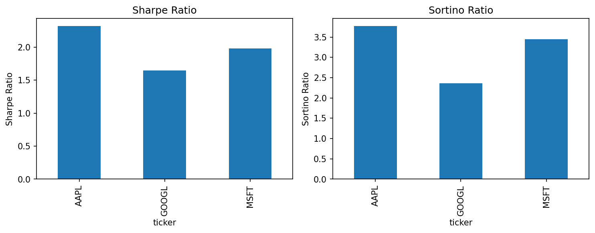

```markdown
# Pandas-YF Star-Schema Risk Report

**Version:** 2025-07-28

A data-engineering pipeline that:

1. Extracts one year of adjusted-close prices from Yahoo! Finance.  
2. Computes annualized Sharpe and Sortino ratios.  
3. Loads results into a PostgreSQL star schema.  
4. Produces a bar-chart report of risk-adjusted returns.

---

## Table of Contents

- [Project Structure](#project-structure)  
- [Prerequisites](#prerequisites)  
- [Setup](#setup)  
- [Database Initialization](#database-initialization)  
- [Workflow](#workflow)  
- [Reporting](#reporting)  
- [Command Reference](#command-reference)  
- [Contributing](#contributing)  
- [License](#license)  

---

## Project Structure

```text
pandas-yf-star-schema-risk-report_28-07-25/
├── src/
│   ├── risk_metrics_etl.py      # ETL: extract → transform → load
│   └── plot_risk_metrics.py     # Reporting: generate bar-chart
├── sql/
│   └── 001_init_star_schema.sql # Star schema DDL
├── notebooks/                   # Exploratory analysis
├── docs/
│   └── img/
│       └── risk_chart.png       # Generated chart
├── .env.example                 # Template for environment variables
├── requirements.txt             # Python dependencies
└── Makefile                     # Common tasks
```

---

## Prerequisites

- **Docker Desktop** (or PostgreSQL 15+ installed locally)  
- **Python 3.9+**  

---

## Setup

1. **Clone the repository**  
   ```bash
   git clone <repository-url>
   cd pandas-yf-star-schema-risk-report_28-07-25
   ```
2. **Configure environment variables**  
   ```bash
   cp .env.example .env
   ```
   Edit `.env` with your database credentials:

   | Variable   | Example     | Description            |
   | ---------- | ----------- | ---------------------- |
   | `DB_USER`  | `postgres`  | PostgreSQL username    |
   | `DB_PASS`  | `pass`      | PostgreSQL password    |
   | `DB_HOST`  | `localhost` | Host or container name |
   | `DB_PORT`  | `5432`      | Port                   |
   | `DB_NAME`  | `finance`   | Database name          |

3. **Start PostgreSQL container**  
   ```bash
   docker run --name finance_pg \
     -e POSTGRES_PASSWORD=$DB_PASS \
     -p $DB_PORT:5432 \
     -d postgres:latest
   ```
4. **Create and activate virtual environment**  
   ```bash
   python -m venv .venv
   source .venv/bin/activate    # macOS/Linux
   .venv\Scripts\activate       # Windows
   pip install -r requirements.txt
   ```

---

## Database Initialization

Execute the schema DDL to create the star schema:

```bash
make db-init
# which runs:
#   psql -h $DB_HOST -U $DB_USER -d $DB_NAME \
#        -f sql/001_init_star_schema.sql
```

**Schema**  
```sql
-- tickers dimension
CREATE TABLE IF NOT EXISTS tickers (
  ticker       TEXT PRIMARY KEY,
  company_name TEXT
);

-- risk_metrics fact
CREATE TABLE IF NOT EXISTS risk_metrics (
  ticker        TEXT REFERENCES tickers(ticker),
  sharpe_ratio  DOUBLE PRECISION,
  sortino_ratio DOUBLE PRECISION
);
```

---

## Workflow

1. **Refresh data and metrics**  
   ```bash
   make etl
   # Equivalent: python -m src.risk_metrics_etl
   ```
2. **Generate report**  
   ```bash
   make plot
   # Equivalent: python -m src.plot_risk_metrics
   ```
3. **(Optional) Lint and type-check**  
   ```bash
   make lint
   # Runs ruff and mypy on src/
   ```

---

## Reporting

The annualized Sharpe and Sortino ratios for the period are plotted side-by-side:



*Figure: Sharpe vs. Sortino ratios for selected tickers.*

---

## Command Reference

| Command        | Description                                         |
| -------------- | --------------------------------------------------- |
| `make db-init` | Apply SQL schema to PostgreSQL                      |
| `make etl`     | Run the ETL pipeline (extract → compute → load)     |
| `make plot`    | Generate bar-chart of Sharpe & Sortino ratios       |
| `make lint`    | Execute code quality checks (ruff & mypy)           |

---

## Contributing

1. Fork the repository.  
2. Ensure code quality:  
   ```bash
   make lint && make etl
   ```  
3. Submit a pull request with a clear description of changes.

---

## License

This project is released under the [MIT License](LICENSE).
```

Feel free to adjust any sections to match your internal style guide (e.g. add a “Contact” or “Security” section), but this layout and tone should align with typical banking/enterprise standards.